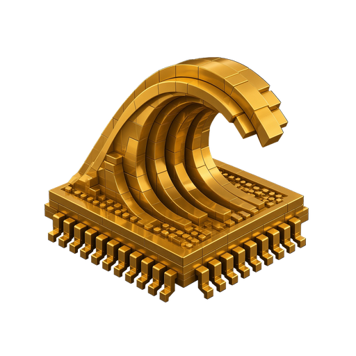

<p align="center">
  
</p>

<h1 align="center">halfphi</h1>

<p align="center">
  <em>Switch-level simulation and analysis of a photographed die.</em>
</p>

<p align="center">
  <a href="https://github.com/tinymachines/halfphi/actions"></a>
  <a href="LICENSE"></a>
  <a href="https://github.com/tinymachines/6502"></a>
  <a href="https://6502.tinymachines.ai"></a>
</p>

---

A chip traced from photographs is a set of polygons, a set of transistors, and
some names. Nothing in it says what the chip *does*.

`halfphi` takes that description and gives you two things: a simulation in which
behaviour is an emergent property of switches opening and closing, and analyses
that recover structure from the switch network rather than being told it.

The name is the unit. A chip driven by a two-phase clock does work on **both**
edges, so half of phi is the smallest step that means anything. Counting whole
cycles loses half the story.

## What it is not

It is not an emulator. There is no instruction table here and no behavioural
model of anything. If you want to know what opcode `$69` does, you run it and
look at what the transistors did.

## Quick start

```rust
use halfphi::{parse, ChipSource, Engine, Netlist, Rails};

let parsed = parse(&ChipSource {
    segdefs: &std::fs::read_to_string("segdefs.js")?,
    transdefs: &std::fs::read_to_string("transdefs.js")?,
    nodenames: &std::fs::read_to_string("nodenames.js")?,
    // Not a constant: the 6800 calls its ground rail `gnd`, not `vss`.
    rails: Rails { ground: "vss", supply: "vcc" },
})?;

let netlist = Netlist::decode(&parsed.blob)?;
println!("{} nodes, {} transistors", netlist.node_count(), netlist.transistor_count());

let mut engine = Engine::new(std::sync::Arc::new(netlist));
engine.force_power_on_state();
engine.restore_layout_pulls();
engine.settle_all();
```

Two runnable examples:

```bash
cargo run --example inspect -- path/to/chip-dir     # what is in this die
cargo run --example settle  -- path/to/chip-dir     # power it on and settle it
```

## The shape of it

```text
  source::parse(&ChipSource)  ->  a netlist blob + geometry
  Netlist::decode(&blob)      ->  topology: nodes, transistors, names
  Engine::new(netlist)        ->  state: settle, read, drive
```

Each step is separable on purpose. Topology is immutable, shared and cache-hot;
state is per-instance and mutable; and a caller that only wants to *analyse* a
chip never has to instantiate an engine at all.

Adjacency is CSR (compressed sparse row): one flat index array plus per-node
offsets, rather than an array-of-arrays. For a chip the size of a 6502 the whole
structure is about 90 KiB and stays in L2 during a run.

## The model

A node's level is not a property of the node but of the **group** of nodes
currently shorted together through conducting transistors. Settling means
rebuilding groups, resolving them, propagating, and repeating to a fixed point.

Group resolution takes the maximum of:

```text
Floating < ChargedHigh < PullDown < PullUp < Vcc < Vss
```

`ChargedHigh` is a group with no driver that still contains a node holding
charge. That is how NMOS dynamic logic retains state between clock phases, and
it is why a chip of this era has a *minimum* clock speed as well as a maximum.

There is no time, capacitance or drive strength here beyond that ordering. It is
enough to reproduce a 6502 cycle-exactly. It is not enough for analogue
questions, and it is worth knowing which you are asking.

## Verified on three chips

`cargo test` loads the 6502, the 6800 and the Z80 through identical calls:

| | nodes | transistors | names | polygons | rails |
|---|---|---|---|---|---|
| 6502 | 1725 | 3510 | 846 | 8233 | `vss` / `vcc` |
| 6800 | 2944 | 3995 | 1144 | 9805 | `gnd` / `vcc` |
| Z80  | 3597 | 6813 | 511 | 14604 | `vss` / `vcc` |

The 6502 figures are checked against values known independently. The other two
are checked for **shape only** — nothing here has verified them against an
outside source, and they should not be quoted as authoritative.

Two things the second and third chips found, both of which a one-chip library
had quietly baked in:

- The 6800 names its ground rail `gnd`. Rails are a parameter for this reason.
- The 6800's `transdefs` carry a seventh field per transistor, a bare `false`.
  The parser had no booleans, having never needed them, and failed at a byte
  offset rather than anywhere meaningful.

**All three converge from a cold power-on, and the Z80 did not always.** Until
the solver stopped writing a group's resolved level back into a rail it had
reached, vcc's stored level bounced with whichever group touched it, and each
bounce switched the **32 transistors gated by the supply rail** on the Z80 (the
6502 has none), which never settled within the hundred rounds the reference
implementation also capped at. That was recorded here as non-convergence and
attributed to the missing per-chip `support.js`, with the vcc-gated transistors
written down as an untested lead. The lead was right and the attribution was
wrong. The write was found from the other direction: a reader of a 6502
simulator's node-level export noticed the declared vcc node toggling. The
reference has the same write and the same blindness (its `stateString` prints
the rails without looking at them), so a differential test could not have seen
it. Rails are now definitions in the solver as well as in the drive rule: never
written, always at their level.

## It carries no die data

That is a licence boundary as much as a design one. The visual6502 die data is
CC BY-NC-SA 3.0, and NonCommercial and ShareAlike propagate to anything that
ships it. This crate is MIT and stays MIT by holding none of it: **you supply the
bytes.** See [NOTICE.md](NOTICE.md) before you redistribute a build.

Test data comes from a git submodule pointing at upstream visual6502, so this
repository does not redistribute it either:

```bash
git clone --recurse-submodules https://github.com/tinymachines/halfphi
cargo test
```

Without the submodule the chip tests **skip** rather than fail. Set
`HALFPHI_REQUIRE_CHIPS=1` to make their absence an error instead, which is what
CI does.

## What a chip layer adds

The library stops at the point where a switch network becomes a *processor*.
What a clock edge is, which nodes are pins, what counts as a register, and how a
bus handshake works are all facts about a particular chip, and they belong in a
crate that is honestly about that chip.

[tinymachines/6502](https://github.com/tinymachines/6502) is one worked example:
a 6502 layer on top of this, with a WebGL renderer of the real die, gate
recognition over the switch network, and a decode-PLA analysis. That project is
where `halfphi` was extracted from.

## Status

Early. The API will move. `0.1` is the shape, not a promise.

MIT — see [LICENSE](LICENSE) and [LICENSE-THIRD-PARTY](LICENSE-THIRD-PARTY).
